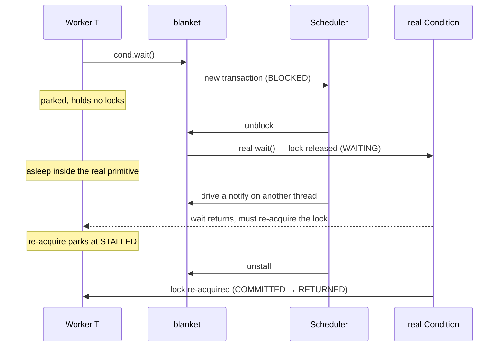
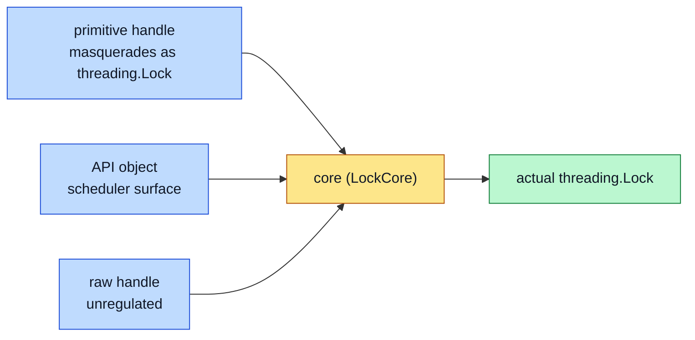

# How it works

This page traces what happens inside blanket when a worker calls a method on a primitive. None of it is required reading
to write tests, but it explains why the API has the shape it does.

## The core idea

Synchronization primitives are nondeterministic. When you call one, you do not know when it returns or which other
threads it let run first. blanket replaces each primitive with a wrapper that does the same work but adds a gate. Every
method call (`lock.acquire()`, `condition.wait()`, `event.set()`) first stops at a point called the scheduler block and
waits for permission. By choosing the order in which it grants permission, the scheduler fixes the order of
synchronization events, and through that the behavior of the whole program.

## A call, step by step

When a worker calls `lock.acquire()`, blanket does not call the real `lock.acquire()` straight away. It builds a
transaction in state `BLOCKED`, parks the worker, and signals the scheduler that a new transaction exists. The parked
worker holds no locks and touches none of the underlying primitive's state. The scheduler can inspect the transaction,
see which method it is on, and decide what to do.

When the scheduler calls `transaction.unblock()`, the worker wakes and the real `lock.acquire()` runs. An uncontended
lock returns at once, and the transaction moves through `COMMITTED` and `EXITING` to `RETURNED`. A contended lock sends
the transaction through `WAITING`, where the worker is genuinely asleep inside the real
[`threading.Lock`](https://docs.python.org/3/library/threading.html#threading.Lock), until the lock frees up.

The real work always happens in the real primitive. blanket decides only when the worker may attempt it.

## Walking through Condition.wait

`Condition.wait` takes the most interesting path, because it parks twice and nests a second transaction inside itself.

The scheduler can observe `WAITING` but cannot end it. Only a `notify`, a release, the last barrier party, or a timeout
wakes a thread out of the real primitive. After the wake, `Condition.wait` has to re-acquire the underlying lock to
honor its contract. That re-acquire is its own synchronization event, so the transaction parks at `STALLED` first,
giving the scheduler one more point to intervene.

For the full state machine, see [transaction states](../reference/transaction-states.md).

## Four objects behind one primitive

A blanket primitive is four objects. `scenario.Lock()` returns a primitive handle that masquerades as a real
[`threading.Lock`](https://docs.python.org/3/library/threading.html#threading.Lock). The scenario also builds an API
object (`scenario.api(lock)`) and a raw handle (`scenario.raw(lock)`). All three wrap a fourth, internal object called
the core, here a `LockCore`. The core does the real work: it tracks transactions, signals state changes, and manipulates
the underlying real primitive.

Each handle is one posture toward the same core. The primitive handle keeps the code under test unaware of the swap. The
API object is the scheduler's surface, with methods like `assign`, `relay`, and `unblock`. The raw handle is the
unregulated escape hatch. The scenario object follows the same pattern: its internal core is called `score`, short for
scenario core, a name you may see in stack traces.

## One lock under it all

Every regulated operation in blanket runs under a single lock owned by the scenario core, `score.lock`. Every primitive
method call, every API-object method, every Driver step, and every scheduler-side change to a transaction takes it.

A single lock sounds slow. In practice it is lightly contended: the scheduler does its work then releases the lock and
waits; workers grab it for a moment as they move through their transaction states, then release it and either proceed or
park. The trade is deliberate. One lock means one consistent view of the world and no races inside blanket itself, at
the cost of a little speed. CPython runs its whole interpreter under one lock, the GIL, and stays usable.

## Drivers stage one step at a time

A `Driver` holds a single pending imperative rather than firing it right away. The point is not to batch intents (a
second imperative on a driver that still has one pending raises). It separates what should happen next from when it
happens.

That separation makes `Chain` work. A chain drives threads one after another. If a driver unparked its thread the moment
you asked, every queued thread would start making progress at once, which defeats the serial ordering a chain exists to
enforce. Laziness lets the chain hold each thread until its turn. The same reason explains why `relay`, `allocate`, and
`cycle` return iterators: each yield is a point to fire one staged step and pause, so the scheduler can act before the
next thread moves.

## Faithful by construction

blanket has no opinion about what synchronization primitives mean, because it reimplements none of them. Every
`lock.acquire()` is a real
[`threading.Lock.acquire()`](https://docs.python.org/3/library/threading.html#threading.Lock.acquire). Every
`condition.wait()` is a real
[`threading.Condition.wait()`](https://docs.python.org/3/library/threading.html#threading.Condition.wait). If a
primitive has a subtle corner case, blanket exhibits that same corner case, because it runs the same code. Your tests
check the real primitive, not a model of it.
