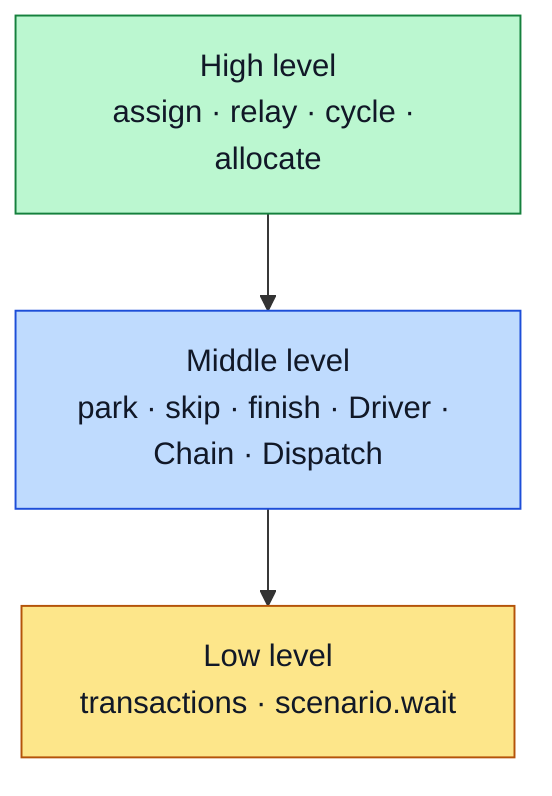

# The three API layers

The blanket API has three layers. Each is built from the one below it, and each higher layer handles common patterns so
you write less.



Spend most of your time at the high level. Drop to the middle level when you need finer control, and reach into the low
level only for tests that need surgical precision. Knowing all three helps, because every abstraction leaks.

## Low level

Two pieces form the foundation: transactions, and `scenario.wait`. Remove either and blanket cannot work.

Every method call on a regulated primitive becomes a transaction. A transaction holds the primitive, the bound method,
the calling thread, the current state, and a few operations the scheduler can run on it. While a thread runs a
transaction, you reach it with `scenario.transaction(thread)` or `scenario.transactions[thread]`.

`scenario.wait(*items, timeout=None)` blocks the scheduler until any of its items signals. See
[wait on signals](../how-to/signals-and-wait.md) for the item types.

## Middle level

The middle level drives threads through sequences of method calls. It has three functions and three classes.

- `scenario.park(*args, wait=False)` drives named threads to specified methods and stops each at the scheduler block,
  leaving its transaction ready to inspect.
- `scenario.skip(*args, wait=False)` drives named threads through one or more method calls each, so they finish those
  calls.
- `scenario.finish(*threads)` drives each named thread to a terminal state, best-effort, for cleanup.

`Driver`, `Chain`, and `Dispatch` give direct control over the driver state machine. A `Driver` attaches to one thread
and accepts one imperative at a time (`skip`, `finish`, `block`, `commit`, `wait`, `stall`, `pause`). A `Chain` runs an
ordered sequence of drivers, activating the next when the current one reaches a terminal state. A `Dispatch` iterates
over whichever driver needs attention next, waking through a single `scenario.wait` on the union of every driver's
signals.

```python
with scenario:
    d1 = scenario.Driver(t1)
    d2 = scenario.Driver(t2)
    d1.skip()
    d2.skip()
    dispatch = scenario.Dispatch()
    dispatch.add(d1)
    dispatch.add(d2)
    for d in dispatch:
        ...
```

For one driver you can skip the dispatch and call the driver directly. `park`, `skip`, `finish`, and the whole
high-level API are built on drivers. Drivers are lazy, which makes chains work; see
[how it works](how-it-works.md#drivers-stage-one-step-at-a-time).

## High level

The high level is a set of methods on the per-primitive API objects, reached with `scenario.api(primitive)`. Each method
captures a common pattern for its primitive.

- `assign(thread, acquirer=None, *, pause=False)` on `Lock` and `RLock` manages one `acquire`, and optionally one
  `release` followed by an `acquire`.
- `relay(initial, *acquirers, pause=False)` on `Lock` and `RLock` passes the lock through an ordered sequence of
  threads. It returns an iterator that yields each acquirer after its `acquire` succeeds.
- `cycle(*threads)` on `Condition`, `Event`, and `Barrier` drives a wait/notify cycle: the waiters call a `wait` or
  `wait_for` method, and the last thread is the opener that wakes them. It returns a context manager whose `wake` and
  `pause` methods let you release waiters in any order.
- `allocate(*threads, pause=False)` on `Semaphore` and `BoundedSemaphore` drives an ordered sequence of acquires and
  releases, sorting out which is which from the method each thread calls.

The API objects also carry `expire`, `disregard`, and `revert` to manage timeouts, each a shortcut for the matching
transaction call:

```python
lock_api.expire(lock.acquire, t1, t2, t3)
```
