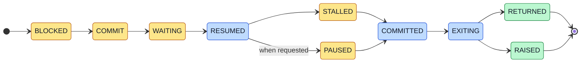

# Transaction states

Every method call on a regulated primitive becomes a transaction, and every transaction is a state machine. It moves
strictly forward through the states below, from `BLOCKED` to a terminal state. It can skip states, but it never moves
backward.

The yellow states are parking states, where a transaction comes to rest. The blue states are transit states it passes
through. The green states are terminal.

## Parking states

Four of the states park: `BLOCKED`, `COMMIT` or `WAITING` (one or the other, depending on the transaction), `STALLED`,
and `PAUSED`. The scheduler controls three of them. `WAITING` belongs to the underlying primitive, not to blanket.

## State by state

- `BLOCKED` is the scheduler block. Every transaction starts here. The method has been called, but no work has happened:
  the worker is asleep inside blanket and the real primitive is untouched. The scheduler can inspect the transaction,
  expire or disregard a pending timeout, and unblock it to proceed.
- `COMMIT` parks timeout-bearing transactions (`Lock.acquire(timeout=...)`, `Condition.wait(timeout=...)`,
  `Barrier.wait(timeout=...)`). The transaction is committed to its action and about to attempt it. The scheduler can
  hold it here for an explicit commit-versus-timeout decision.
- `WAITING` parks transactions blocked inside the real primitive. The transaction has called the real
  `condition.wait()`, the contended `lock.acquire()`, the real `barrier.wait()`, and is genuinely asleep inside it. The
  scheduler can observe this state but cannot end it. Only a notify, a release, the last barrier party, or a timeout
  wakes it. For `Condition.wait`, this is also where the underlying lock is dropped and later re-acquired; the
  re-acquire is a nested transaction.
- `STALLED` is the scheduler stall. The transaction has woken from `WAITING` (or `COMMIT`) and is back under scheduler
  control, but has not yet done its post-wake work. This is where you intercept a thread after a real wait returns but
  before it commits.
- `RESUMED` is a transit state, in flight again after `WAITING` or `COMMIT`.
- `COMMITTED` is a transit state. The transaction has done its commit work and heads toward exit.
- `PAUSED` is the scheduler pause, a general-purpose park reachable at any point. The scheduler requests it by setting
  `tx.pause = True`, and the transaction stays until every party that set the flag clears it. The high-level helpers use
  it.
- `EXITING` is a transit state on the final flight to terminal.
- `RETURNED` is terminal: the method returned normally.
- `RAISED` is terminal: the method raised an exception.

## Notes per method

Methods not listed pass through the lifecycle without surprises.

### Lock and RLock

- `acquire(blocking=True, timeout=-1)` is timeout-bearing, so it visits `COMMIT`. A contended lock visits `WAITING`,
  asleep inside the real
  [`threading.Lock.acquire`](https://docs.python.org/3/library/threading.html#threading.Lock.acquire), until the lock
  frees or the timeout fires.
- `release()` passes through after the scheduler block, with no `WAITING`, `COMMIT`, or `STALLED`.

`RLock` matches `Lock`, with reentrancy handled by the real
[`threading.RLock`](https://docs.python.org/3/library/threading.html#threading.RLock).

### Condition

- `acquire`, `release` match `Lock`.
- `wait(timeout=None)` is timeout-bearing (`COMMIT`), has a real `WAITING` with the lock dropped, and visits `STALLED`
  after waking before the internal lock re-acquire. The re-acquire is a nested transaction; while it runs,
  `Nested(wait_tx)` signals.
- `wait_for(predicate, timeout=None)` is timeout-bearing and nests at least one `Condition.wait`. If the predicate calls
  primitive methods, those nest too.
- `notify(n=1)`, `notify_all()` pass through after the scheduler block.

### Semaphore and BoundedSemaphore

- `acquire(blocking=True, timeout=None)` is timeout-bearing and visits `WAITING` when the counter is zero.
- `release(n=1)` passes through. On `BoundedSemaphore`, `release` raises if it would exceed the initial value.

### Event

- `wait(timeout=None)` is timeout-bearing and visits `WAITING` while the event is not set.
- `is_set()`, `set()`, `clear()` pass through.

### Barrier

- `wait(timeout=None)` is timeout-bearing and visits `WAITING` for the first `parties - 1` arrivers. If the barrier has
  an `action` callback, the final arrival's transaction (the opener) pushes itself off its thread's transaction chain
  before running the action. While pushed, `Action(opener_tx)` signals, and any primitive calls inside the action appear
  as fresh root transactions rather than children. So `Nested(opener_tx)` does not fire during the action; use
  `Action(opener_tx)` instead.
- `reset()`, `abort()` pass through.
